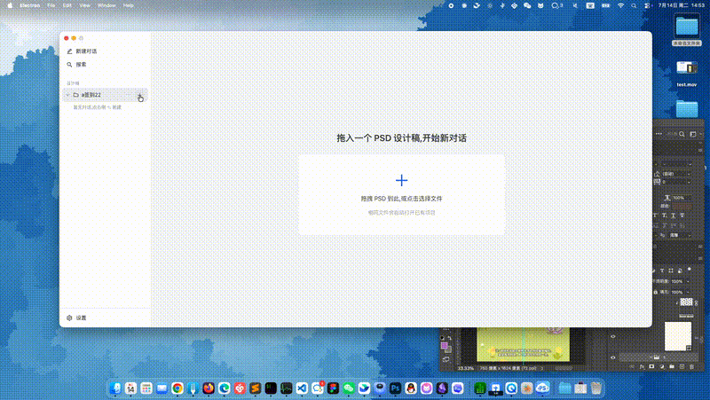
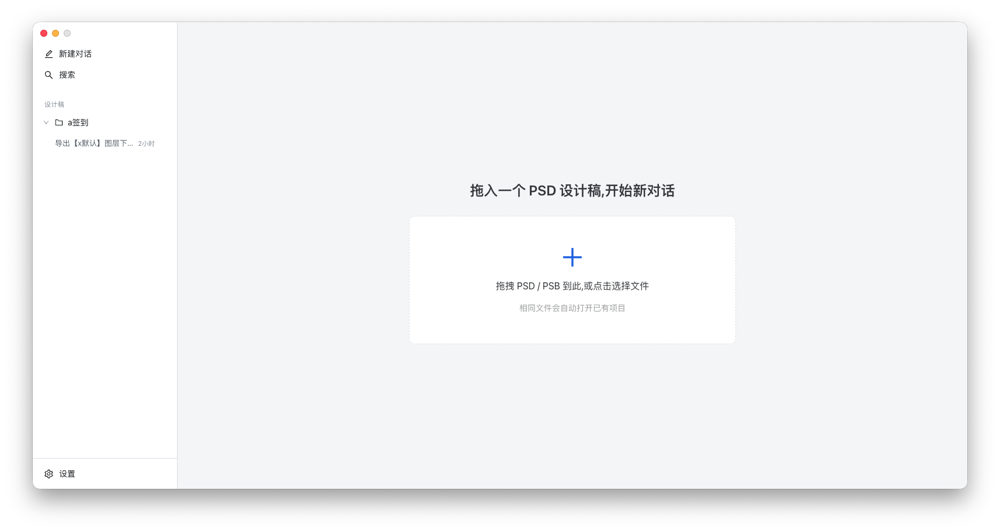
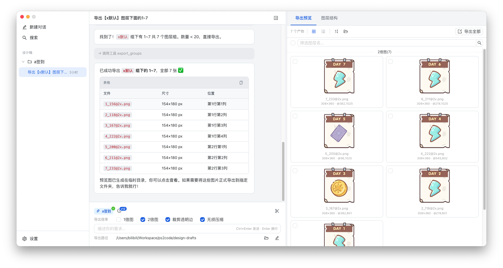
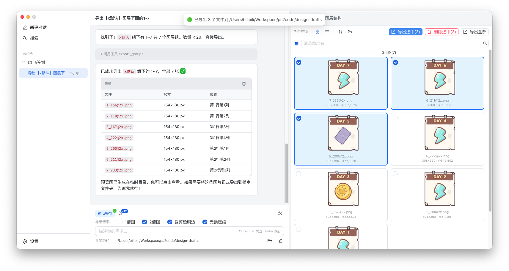
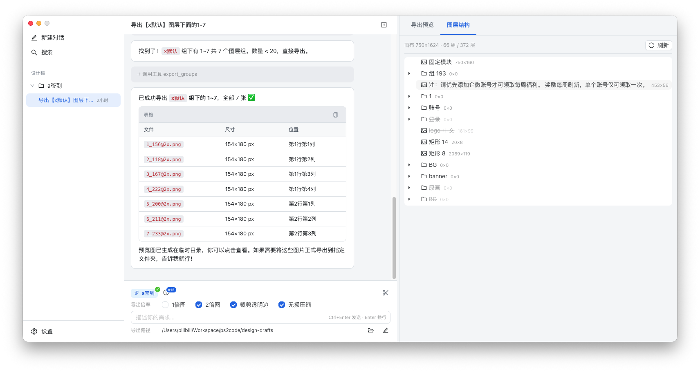
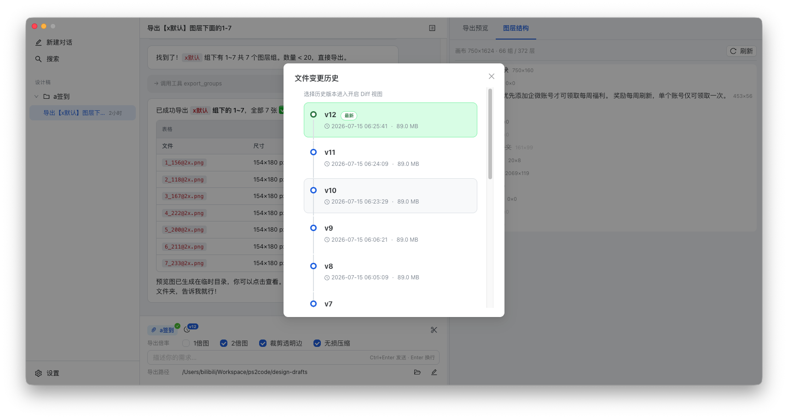
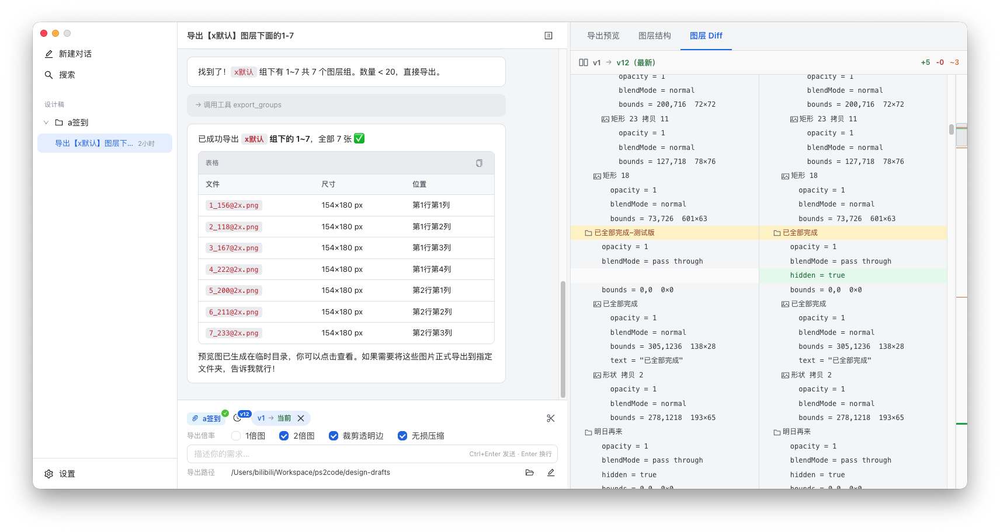
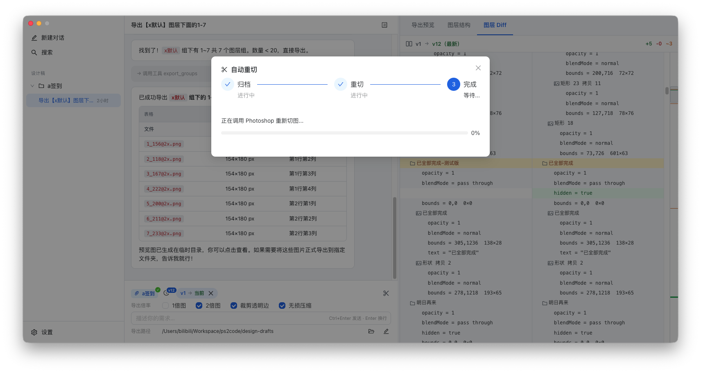
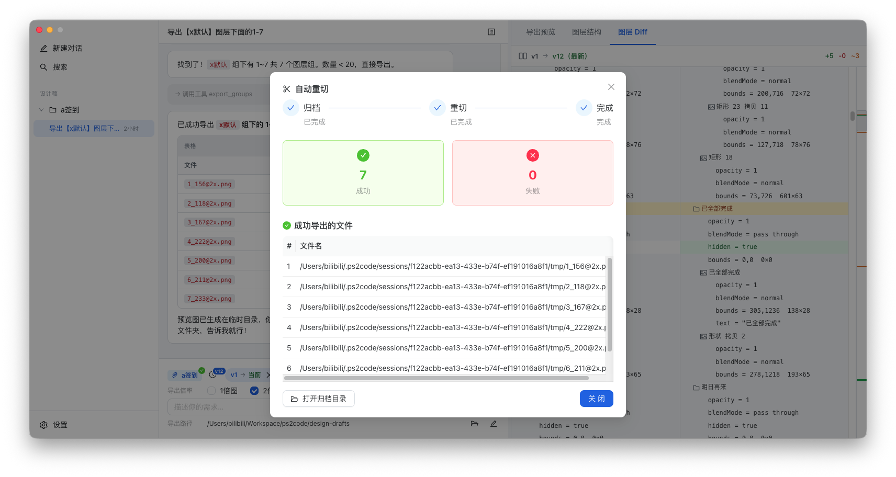

# PS2Code v0.2.0

通过 AI 对话驱动的 Photoshop 设计稿导出工具。连接本地 Adobe Photoshop，让 AI Agent 理解图层结构、执行切图导出，并自动追踪版本变更。



---

## 优点

### ⚡ 速度快
AI Agent 直接在本地 Photoshop 中操作图层，无需上传设计稿到云端。图层搜索、重命名、导出全部在毫秒~秒级完成。

### 💰 成本低
AI 只在「理解用户意图 → 生成操作指令」阶段消耗 API Token。**导出本身由 Photoshop 本地脚本执行，完全不消耗 AI Token。**  
自动重切功能也是纯本地操作（读取已有配置 → 调 Photoshop 重新导出），**零 AI 成本**。

### ♻️ 可复用
每次导出都会生成 `_meta.json`，记录每个切图的图层 ID、路径、坐标。后续：
- **自动重切**：设计稿修改后一键重新导出，无需重新描述需求
- **增量导出**：基于已有配置，只导出变更的部分
- **跨对话复用**：同一项目的切图配置可在不同对话间共享

---

## Features

### 📥 拖拽导入，快速开始

| |
|---|
|  |

将 `.psd` / `.psb` 文件拖入应用或点击「新对话」选择文件，自动创建项目并进入对话。Photoshop 自动打开设计稿，准备就绪。

---

### 💬 AI 对话切图

| |
|---|
|  |

用自然语言描述需求，AI Agent 自动：
- 搜索图层（按名称模糊/正则匹配）
- 定位到精确的图层组
- 调用 Photoshop 脚本导出为 PNG（支持 1x / 2x 倍率）
- 裁剪透明边、无损压缩

**示例指令：**
```
把"组 84"下的图标导出，2倍图
搜索所有带"btn"的图层，导出为 PNG
```

---

### 📐 灵活导出设置

| |
|---|
|  |

- 独立的 1x / 2x 导出倍率开关
- 裁剪透明边
- PNG 无损压缩（sharp 后处理）
- 自定义导出目录

---

### 🧅 图层树同步

| |
|---|
|  |

实时查看 Photoshop 设计稿的完整图层结构树，支持展开/折叠和搜索，窗口聚焦时自动刷新。

---

### 📊 版本追踪

| |
|---|
|  |

| |
|---|
|  |

每次切换回应用时自动检测 PSD 文件变化：
- 自动创建版本快照（v1, v2, v3...）
- 版本变更摘要（新增/删除/修改的图层）
- **Side-by-side Diff 视图**：逐行对比两个版本的图层结构变化
- 右侧 minimap 标尺，点击跳转到变更行
- 变更计数：🟢新增 / 🔴删除 / 🟠修改

> 检测到新版本时，vN 标签旁会出现红色上升箭头（↑）动画，持续 30 秒后自动消失。

---

### ✂️ 自动重切

| |
|---|
|  |

| |
|---|
|  |

设计稿修改后，一键重新导出所有已切图片：

1. 点击 **剪刀图标**（有预览图片时显示在工具栏最右侧）
2. 自动归档原导出到 `[自动重切备份:时间]` 文件夹
3. 基于已有切图配置（图层 ID/路径）调用 Photoshop 重新切图
4. 实时展示进度和结果报告（成功/失败列表）

自动重切不经过 AI Agent，**零 Token 消耗**。

**归档目录**：`~/.ps2code/archives/<对话ID>/`，支持在「导出预览」面板查看和打开

---

### 🖼️ 导出预览

右侧面板展示所有导出图片：
- 网格 / 列表视图切换
- 图层名筛选搜索
- 空格放大预览
- 批量删除 / 批量导出
- **归档文件夹浏览**：展开归档列表，点击打开 Finder

---

## 界面概览

| 区域 | 功能 |
|------|------|
| 左侧栏 | 项目列表、对话历史 |
| 中间 | AI 对话区域 + 输入框 + 导出设置 |
| 右侧面板 | 导出预览 / 图层树 / Diff 视图 |
| 底部 Composer | 设计稿别针、版本入口、导出倍率设置、剪刀重切按钮 |

---

## 许可

MIT
